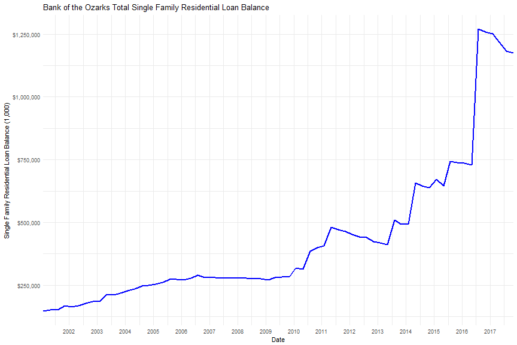
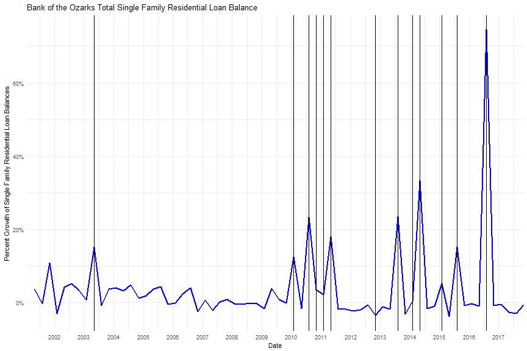

Applied Economics in Finance and Banking 
========================================================
autosize: true
transition: rotate
type:section
 
 
<a href="https://www.linkedin.com/in/nick-lewellen-8b305472/">Nick Lewellen</a>  
Senior Credit Data Analytics Officer  
April 13th, 2018  

</img>

Background
========================================================
type:exclaim

## Education

- B.A. Economics, University of Tulsa, 2013
- M.A. Economics, Duke University, 2015
- M.S. Analytics, Georgia Institute of Technology, Present

## Work

- Financial Analyst, CFO Network, 2016-17
- Quantitative Risk Modeler, Bank of the Ozarks, 2017-18
- Senior Credit Data Analytics Officer, Bank of the Ozarks, 2018-present

Graduate Education
========================================================

## Why?

- If you ask "Why should I go to graduate school" and the answer
mentions the job market, start over. 

## Where?

- Better schools are preferred. 
    - If Master's, then name brand.
    - If PhD, experience and environmen.
- Go somewhere you'll be happy. 
- Consider online or distance programs. 
    - Often cheaper
    - Allow you to work 
    - Excellent Universities (Hopkins, GA Tech, Penn State)

 

Graduate Education pt. 2
========================================================

## When?

- There is no good answer for this. 
- Right after college or a few years after can both work.

<b>Don't take advice on graduate school (or anything else) too seriously!</b>
 
- Advice is always based on personal experience. My experience is not your experience.

- You have your own tastes and preferences, and you know them better than I do. 

- It's really hard to make a life ruining decision right after college. 

My Experience at Duke
========================================================
 
- Math
- Most econ programs are very structured.
- Augment your education to your interests and needs. 
- It's going to be hard. 

Job Opportunities in Banking
========================================================

## Data and Statisitics 

- Commercial banking as perfect competition
- The analytics revolution in commercial banking
- Economists are suited to the task

## Dodd-Frank Act

- The Dodd Frank Act Stress Testing (i.e., DFAST) created an even greater need for 
economists, data scientists and analytics experts in banking.
- Despite what you hear, the industry has seemed to welcome the influx of talent.
- Even if DFAST is repealed, Stress Testing and economic analysis still has a place in
banking.

Stress Test Case Study
========================================================

- If the economy enters a recession, what happens to the 
bank's assets, deposits, etc.?
- The goal is to produce financial statements and projects
based on three scenarios: baseline, adverse, severely adverse.
- Example: Single Family Residential balances

Stress Test Case Study pt. 2
========================================================

- Initial questions:
    - What happened during other recessions?
    - What factors contributed to the bank's growth and 
    contraction? 

Stress Test Case Study pt. 3
========================================================

- The DFAST problem is in changes. 
- BOTO grew from acquisitions. 

- Include binary variables for acquisitions

Stress Test Case Study pt. 4
========================================================

- The DFAST problem is in changes. 
- BOTO grew from acquisitions. 

- Include binary variables for acquisitions

Job Market Suggestions
========================================================

- Since Nov. 2017, I have interviewed dozens of people for entry
level and senior level positions at BOTO. 
- Mistake free resume and cover letters. 
- Do your research!
- Skills:
    - SQL (must!)
    - R or Python
    - SAS, Stata, Eviews, etc.
- Be proactive
- Show don't tell 

Questions and Follow Up
========================================================
 
## Questions?
 

## Contact

Linkedin: <a href="https://www.linkedin.com/in/nick-lewellen-8b305472/">Nick Lewellen</a>   
Email: <a href="nlewellen@bankozarks.com">nlewellen@bankozarks.com</a>  
Phone: 501-352-8985  
 
